Tutorial: Creating a SpecLog HTML export plugin
====================

In this tutorial, we will show you how to create a simple server-side plugin for [SpecLog](http://speclog.net "Click to visit http://speclog.net") - a plugin which is able to periodically export shared repositories to a browsable HTML-format. 

## Table of contents

1. [**Setting up the project structure**](#1)
2. [**Adding references**](#2)
3. [**Setting start actions and post-build events**](#3)  
  3.1. [**Start actions**](#3.1)  
  3.2. [**Post-build events**](#3.2)
4. [**Implementing the plugin - Step 1**](#4)  
  4.1. [**The client side**](#4.1)  
  4.2. [**The server side**](#4.2)
5. [**Starting the plugin**](#5)
6. [**Implementing the plugin - Step 2**](#6)  
  6.1. [**Finishing the configuration dialog**](#6.1)  
  6.2. [**Creating a periodic activity**](#6.2)  
  6.3. [**Using dependency injection with Unity**](#6.3)
7. [**Finishing the plugin**](#7)

## 1. Setting up the project structure

At the first step, you have to create a new solution with two projects. When creating the projects, use the *Class Library* project template for *.NET Framework 4 Client Profile*. In our case, we named our projects **SpecLog.HtmlExportPlugin.Client** and **SpecLog.HtmlExportPlugin.Server**, for the client and the server part, respectively:

  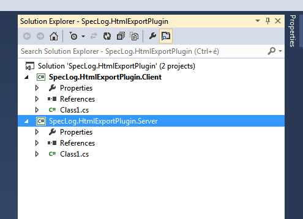  
  Project structure for the solution

The client part will contain the user interface for the plugin configuration, and the server part will contain the plugin logic (in this example, the HTML generation) itself.

## 2. Adding references

You have to add the references to the appropriate assemblies for the client side project:

    
  References of the client side project

It can be seen that on the client side we have to use the .NET Framework assemblies `System.Xaml.dll` and `WindowsBase.dll` - we will need these when creating the user interface for the plugin configuration.

The other assemblies (starting with `TechTalk.`) exist in your SpecLog installation directory (which is `C:\Program Files (x86)\TechTalk\SpecLog` by default)
It's a good practice to create a separate folder inside your solution, such as `solutionDir/External/SpecLog` where `solutionDir` is the path where your solution is located. Then you can easily copy the whole SpecLog installation directory inside the External folder, which will produce a directory structure like this:

    +SolutionDir
       |-- External
            |-- SpecLog
                 |-- Client
                 |-- Server                            
       |-- SpecLog.HtmlExportPlugin.Client
       |-- SpecLog.HtmlExportPlugin.Server

For the rest of this tutorial, we will assume that you have a directory structure like this.

You have to do the same for the server side project as well:

  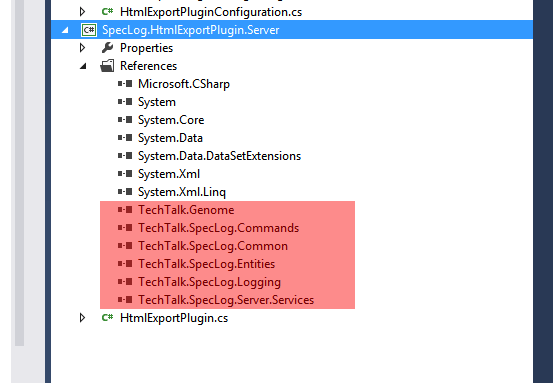  
  References of the server side project

After adding references to the used assemblies, we should fix the start actions and the post-build events for these projects to get our plugin up and running.

## 3. Setting start actions and post-build events

### 3.1. Start actions

Select the Debug tab on the project properties for the client project, and set it up in the following way:

    
  Debug settings of the client side project

It will start `SpecLog.exe` (the SpecLog client) when the plugin is debugged.

On the other hand, we will start `SpecLog.Server.exe` (the SpecLog server) for the server-side project. Apply the following settings on the `SpecLog.HtmlExportPlugin.Server` project:

    
  Debug settings of the server side project

Don't forget the command line argument. It will get the server to run in a command line console.

### 3.2. Post-build events

In order to get the plugin running we have to make the new plugin available and discoverable for SpecLog. To achieve this, set up a post-build event which will copy plugin and the dependent assemblies to special folders in the `External\SpecLog` directory: the `Client\Plugins` and the `Server\Plugins`.

  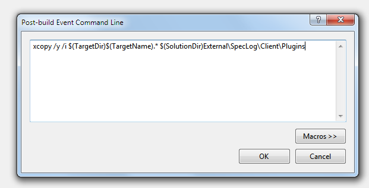  
  Post-build event of the client side project

  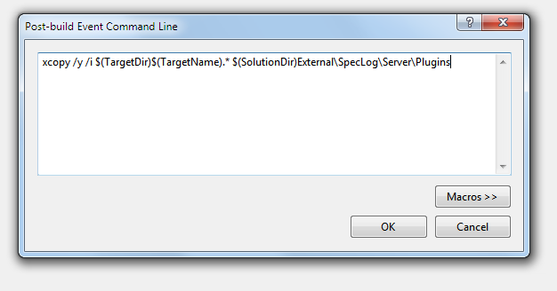  
  Post-build event of the server side project

## 4. Implementing the plugin - Step 1

### 4.1. The client side

Let's start with the client side. At the first step, create a class which implements the `TechTalk.SpecLog.Application.Common.PluginsInfrastructure.IClientPlugin` interface. Every client plugin have a name (which has to be unique) and a description. `IClientPlugin` also provides a method called `GetConfigDialog` which returns a view model object for the configuration dialog:

The client side which implements the `IClientPlugin` interface has to be marked with the `Plugin` attribute as well. Marking the class with the `Plugin` attribute is important because SpecLog identifies a class as a plugin by this attribute.

Now it's time to create a configuration class for the client and the server side as well. Create two configuration classes as seen below - one in the client side project and the other one in the server side project. These configuration classes contain plugin-specific properties you want to be configured by the user (in our case, the user can configure the output path of the generated HTML file and a time interval of the periodic HTML generation)

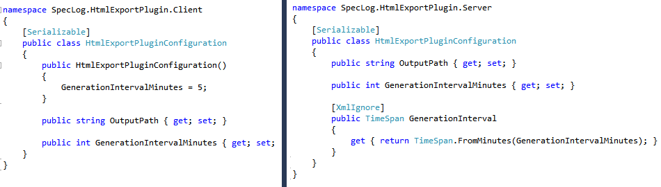

After you have the client configuration class, we can create a view model for the configuration dialog.

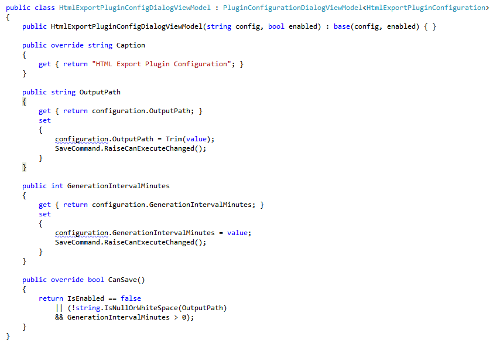

Let's create a new user control - a basic configuration dialog view:

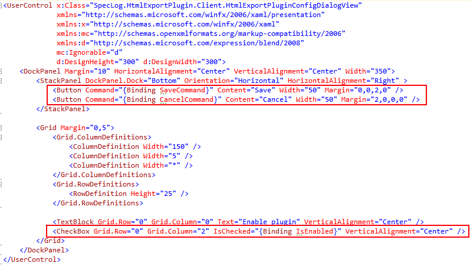

### 4.2. The server side

Create a plugin class, similar to the one we already have in the client-side project, but now on the server side. We use the base class `TechTalk.SpecLog.Server.Services.PluginInfrastructure.ServerPlugin` and the same attribute which we used on the client-side (`TechTalk.SpecLog.Common.PluginAttribute`).

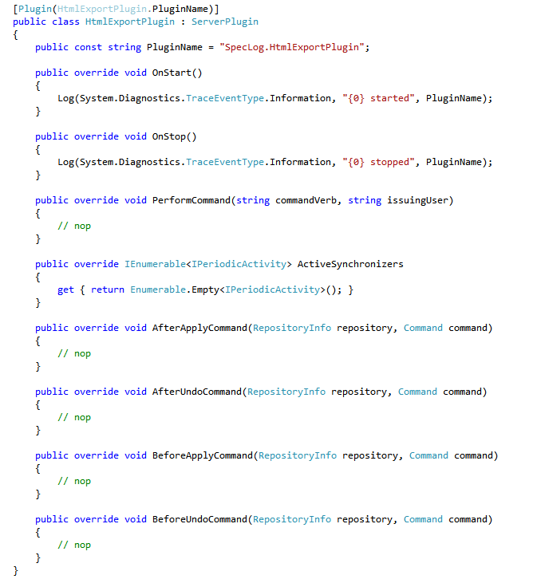

For the first time, our server-side plugin doesn't do anything interesting, but it's enough for now to start the plugin.

## 5. Starting the plugin

Let's build the project and start debugging! Because we have set the start actions for our projects, the SpecLog client and the server will start up, but the plugin is not running yet. We have to start it manually.

So in the SpecLog client, click on the **Manage repositories** option in the main menu, and connect to the server running in our console. After a successful connection, you will see the server repositories listed in the dialog. Click on a shared repository, and choose **Configure plugins** from its context menu. You should see the name of your plugin in the list. Select the **Configure** from its context menu to open the configuration dialog for this plugin. Because we have only created *Save* and *Cancel* buttons with a simple checkbox for enabling the plugin, what you will see is a very basic dialog. Let's use this dialog to enable the plugin: check in the "Enable plugin" checkbox and click on the *Save* button to save your settings and close the dialog.

    
  Configuration dialog for the HTML export plugin

The status of the plugin then can be seen on the server plugin configuration dialog as well as the server console:

  

After we made sure that the plugin can be loaded and started without errors, we can continue to implementing the HTML export plugin.

## 6. Implementing the plugin - Step 2

### 6.1. Finishing the configuration dialog

Now we can create a user interface which is binded to the configuration view model:

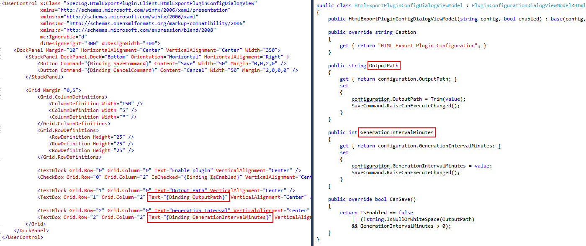

### 6.2. Creating a periodic activity

Since we implement a plugin which needs periodic task execution, we will need to create some kind of "periodic activity": we will use `TechTalk.SpecLog.Common.PeriodicActivity` for this purpose. Create a new class called `HtmlExportActivity` which inherits from `PeriodicActivity`:

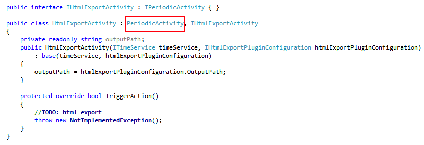

Now we could create and start that activity on the server side whenever the plugin starts and stop it when the plugin stops:

As you can see, to create `HtmlExportActivity`, we need a service which implements the `ITimeService` interface. Fortunately, this service is provided for us by the DI container [used in SpecLog](http://unity.codeplex.com/). The other dependency of the `HtmlExportActivity` is a configuration which implements the `IHtmlExportPluginConfiguration` - we introduced this interface to mark the server-side configuration class.

### 6.3. Using dependency injection with Unity

The method described above works fine for the first sight, but you may start to think about what would happen if the `HtmlExportActivity` class had numerous dependencies? Now we have two, the time service and the configuration, but in fact, soon we will have to introduce more: the `HtmlExportActivity` will depend on services which responsible for generating the HTML, loading the repository language, loading requirements, and so on.

SpecLog uses [Unity](http://unity.codeplex.com/) to deal with the complexity of the dependency graphs.

Let's create a class which implements the `TechTalk.SpecLog.Common.IPluginContainerSetup` in the following way:

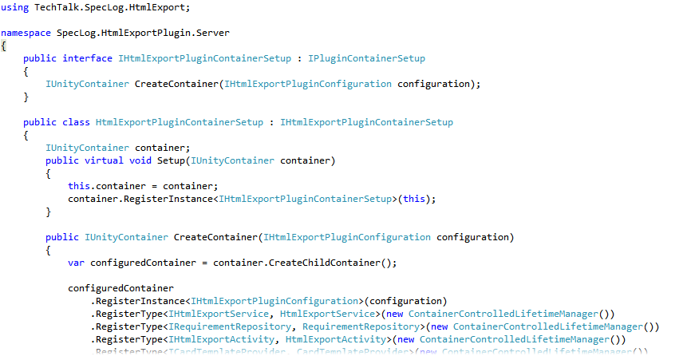

The `IPluginContainerSetup` provides a method `CreateContainer` which can create a Unity container for us. 
Now we can use that container setup to resolve the registered dependencies for the `IHtmlExportActivity`:

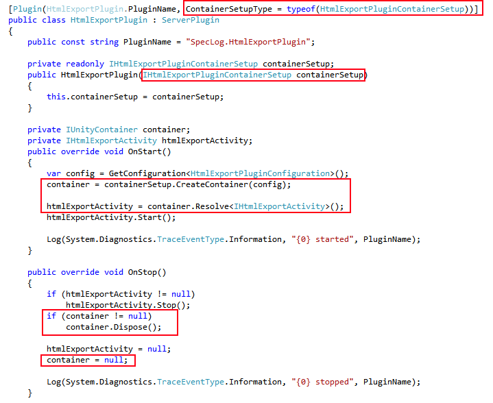

### 7. Finishing the plugin

We have one more task left: implementing the core functionality of our plugin - in our case, this is the HTML export.
We can place the code which is responsible for the HTML export to the `TriggerAction` method of the `HtmlExportActivity` class. Since SpecLog already contains a service which is capable of the HTML export, the code will be simple:

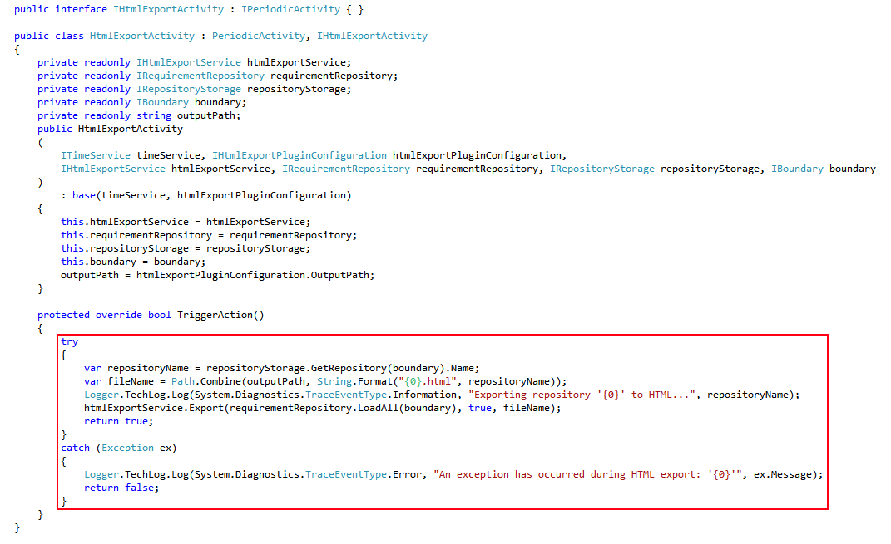